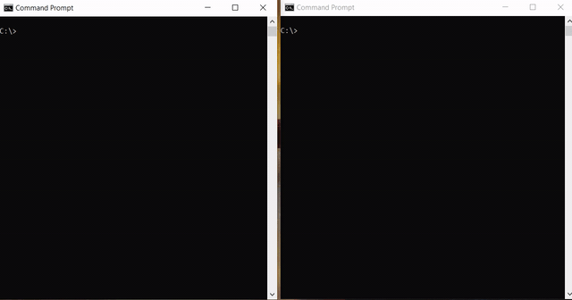

Gestion de tous ce qui est ***connectivité /échange*** entre Clients (2 max) et Serveur.
Ce dossier contient 4 fichiers **java** où :
- **Client.java** et **Server.java** sont utilisés sur des systèmes Unix (tester sur un ***debian***) => Ajout de couleurs **UNIQUEMENT compatible avec linux**. (Couleurs qui ne s'affichent pas dans le "command prompt" de windows).
- **Client2.java** et **Server2.java** => Même contenu que les 2 autres fichiers mais **SANS couleurs** pour rendre **COMPATIBLE avec TOUS les OS**.\
:point_right: On peut très bien avoir un linux qui lance la version **avec couleurs** (ex: *Client*) et un windows qui lance la version **sans couleurs** (ex: *Server*).
#### Tâches :
- [x] Programme fonctionel.
- [x] Implémentation de couleurs pour rendre celui-ci plus attirant.
- [x] Ajout d'une version compatible avec tous les systèmes d'exploitation.
- [ ] Intégration d'une interface graphique (java fx ?).
- [ ] Commenter le code + nettoyages.
- [x] Ajout de démos dans ce readme.

## Petite Démo :
- Version **avec couleurs** (sous ***Linux***) :\
  :point_right: Juste besoin d'exécuter les fichiers java

- Version **Sans couleurs** (sous ***Windows***) => Compatible avec **TOUS les OS** :\
  :point_right: On doit d'abord indiquer au système où se trouve l'intallation de java.

